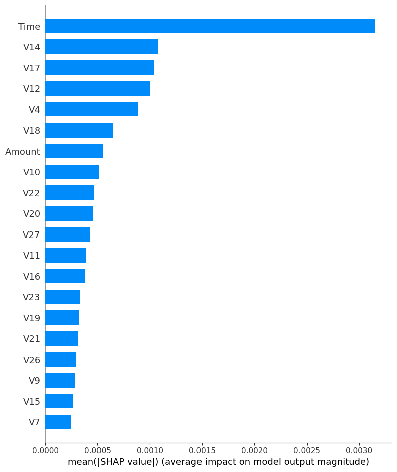

Welcome to dondae01.github.io

This is the personal website of Daegan, showcasing projects, insights, and work related to machine learning, explainable AI, and data science.

Project Highlights

1. Explainable AI (XAI) in Predictive Modeling
- Overview: Implemented a RandomForest model to detect fraudulent transactions, with a focus on explainability using SHAP and LIME.
- Goal: Provide transparency and interpretability of model predictions to ensure trust and insight into key factors driving predictions.
- [Read the Full Summary](xai_summary.md)

Visualizations:
- SHAP Dependence Plots: The following visuals help explain the impact of key features on model predictions:
  - 
  - 
  - 
  - 
- SHAP Summary Plot: 

2. Other Projects
- More projects will be added here as they are completed, highlighting key skills in data analysis, machine learning, and software development.

About Me
I am an aspiring business analyst and machine learning enthusiast, passionate about leveraging technology to gain actionable insights and solve real-world problems.

Feel free to explore this website to learn more about my projects and experience!

Contact
You can reach me through GitHub or connect on [LinkedIn] (https://www.linkedin.com/in/daeganpimenta/) for more information or collaboration opportunities.

How This Site Was Built
This website is hosted using GitHub Pages and built using a combination of Markdown for project summaries and HTML/CSS for styling.

Repository Link
- [GitHub Repository for This Site](https://github.com/dondae01/dondae01.github.io)

